# 00 - Emotion Detector For Therapy

## Tujuan Pembelajaran

1. Mahasiswa mampu menerapkan segala unsur yang sudah dipelajari sebelumnya untuk diimplementasikan ke project akhir

## Hasil Praktikum

### 1) Mockup

- Halaman Splash Screen

- Halaman Home Screen

- Halaman Scan

- Halaman Medical Report

- Halaman Profile
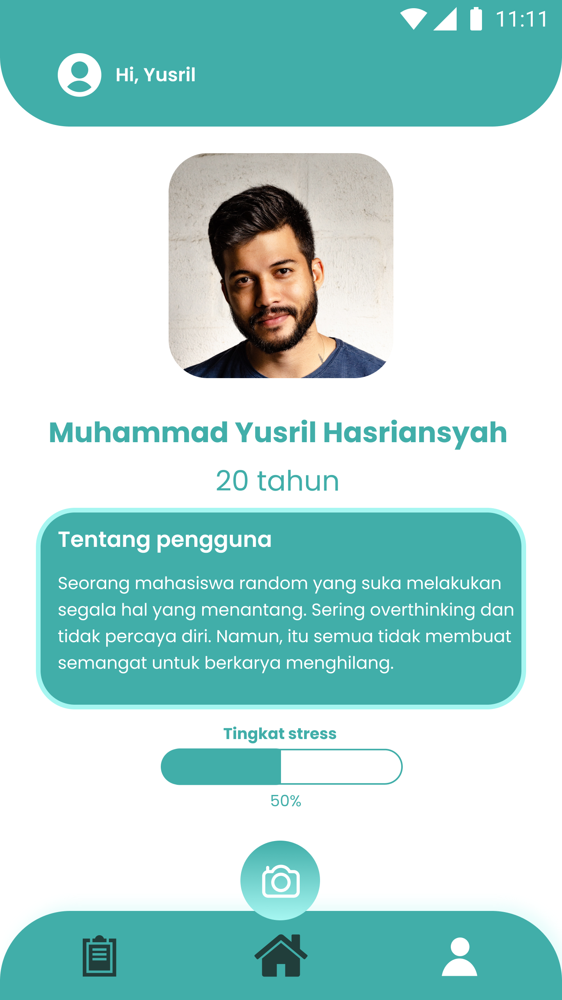

### KUIS 2

1. Data Binding

    Membuat databinding untuk textview bertuliskan "Hi, Yusril"

    - File java : 
    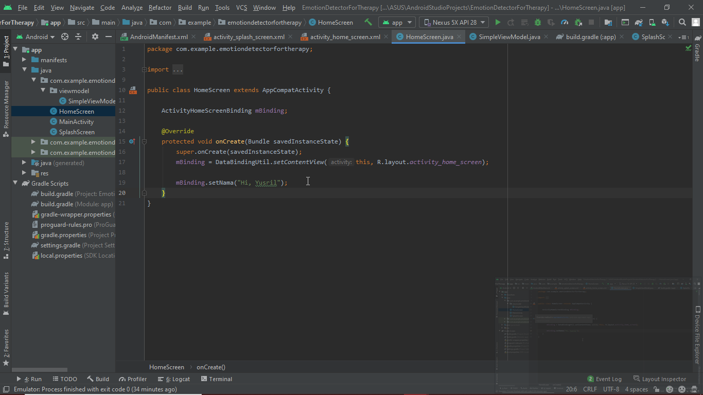

    - Hasil akhir + XML :
    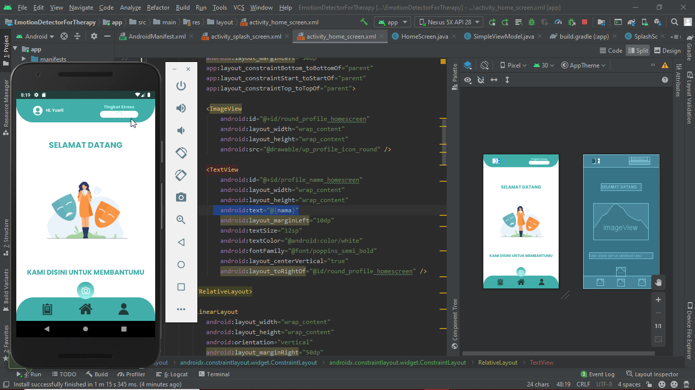
    
2. Fragment

    Membuat fragment untuk splash image pada homescreen

    - Fragment XML :
    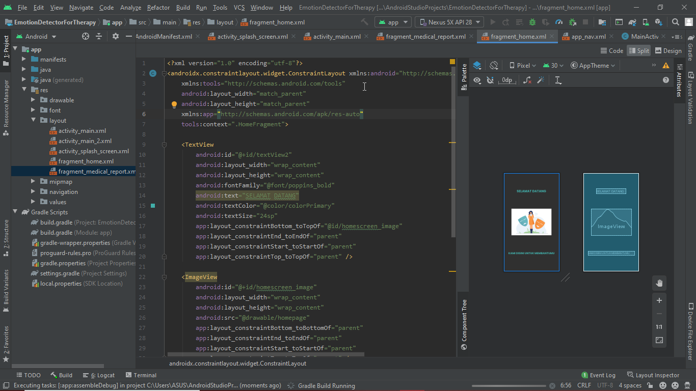

    - Fragment Hasil :
    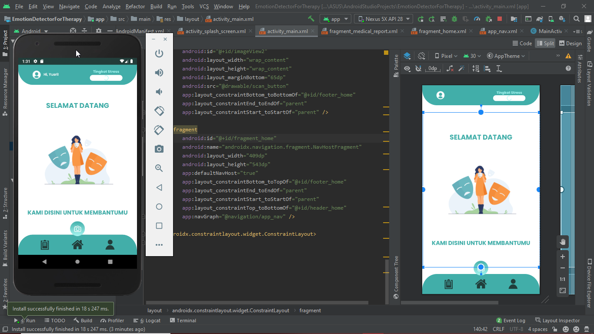

3. Navigation

    Membuat navigation dari halaman home ke halaman medical report dan home sebagai navHost

    - Halaman Home :
    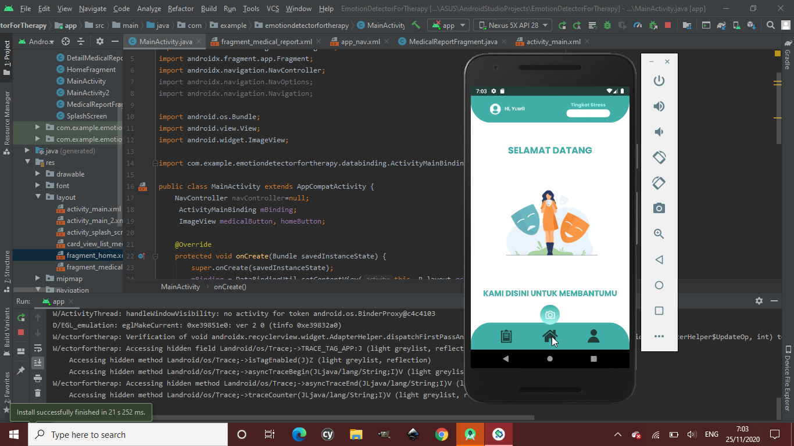

    - Halaman Medical Report :
    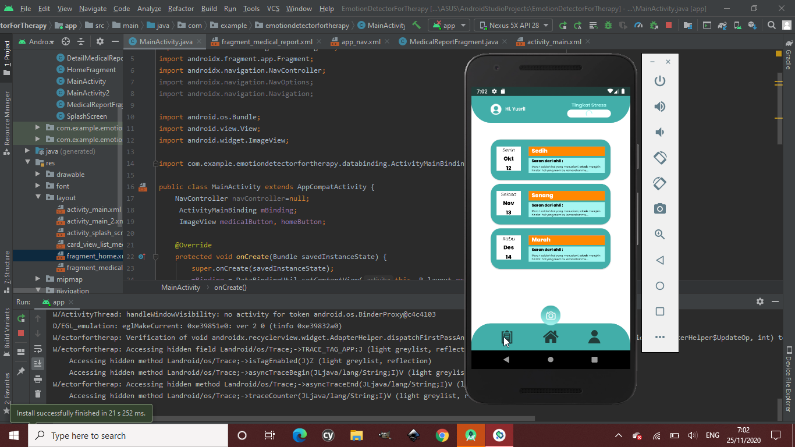

### Layout pada android

1. Halaman Home
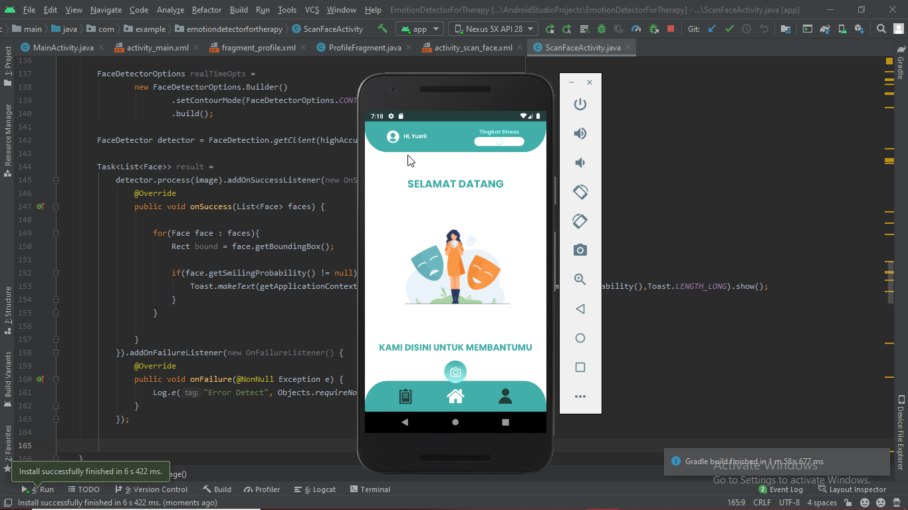

2. Halaman Medical Report
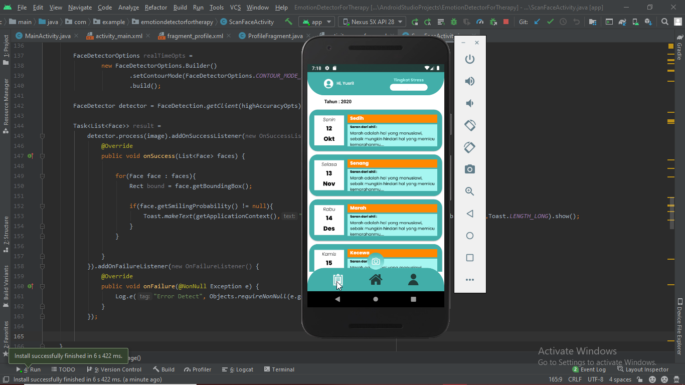

3. Halaman Profile
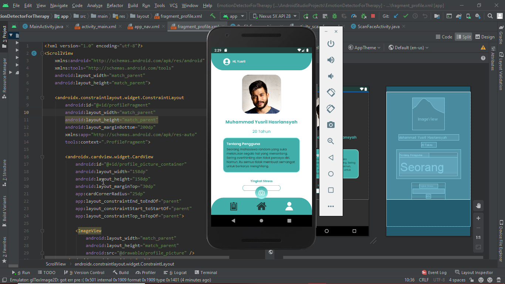

4. Halaman Scan
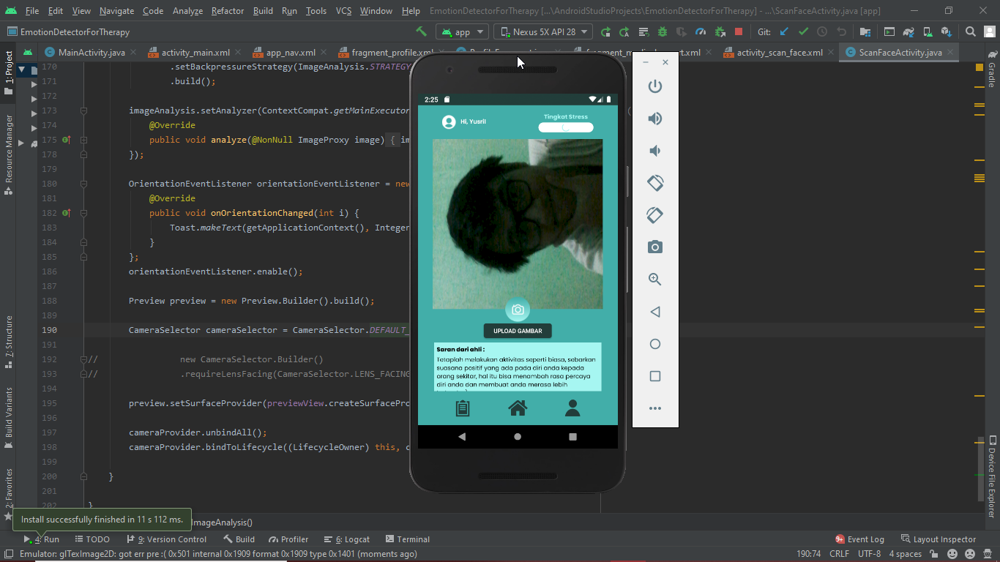

    ### Note : Halaman scan cameranya masih terputar previewnya