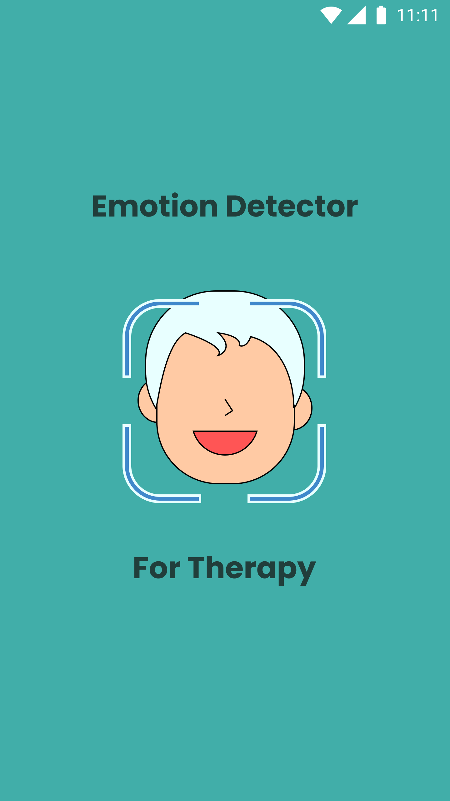
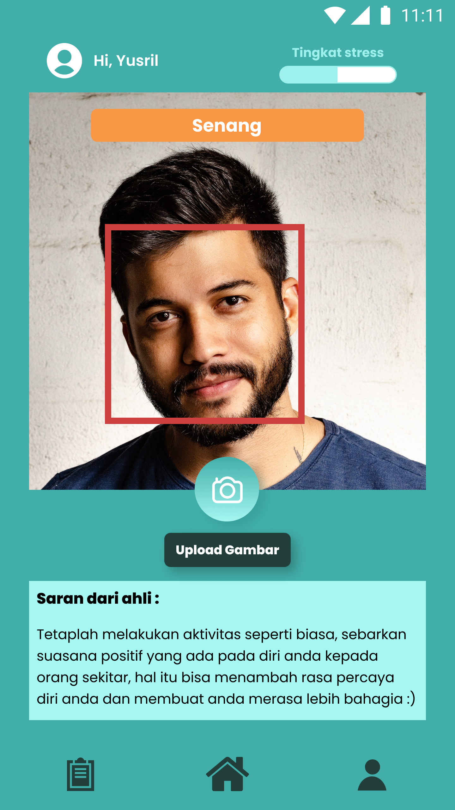
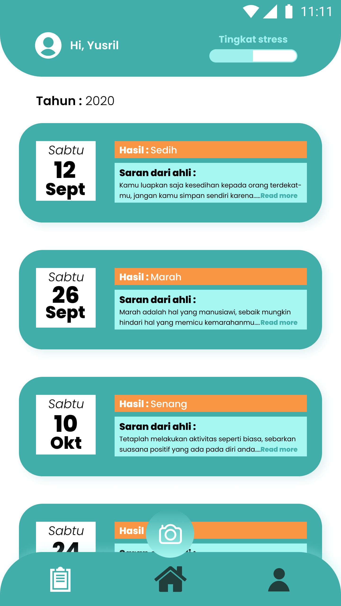

# 00 - Emotion Detector For Therapy

## Tujuan Pembelajaran

1. Mahasiswa mampu menerapkan segala unsur yang sudah dipelajari sebelumnya untuk diimplementasikan ke project akhir

## Hasil Praktikum

### 1) Mockup

- Halaman Splash Screen

- Halaman Home Screen

- Halaman Scan

- Halaman Medical Report

- Halaman Profile
