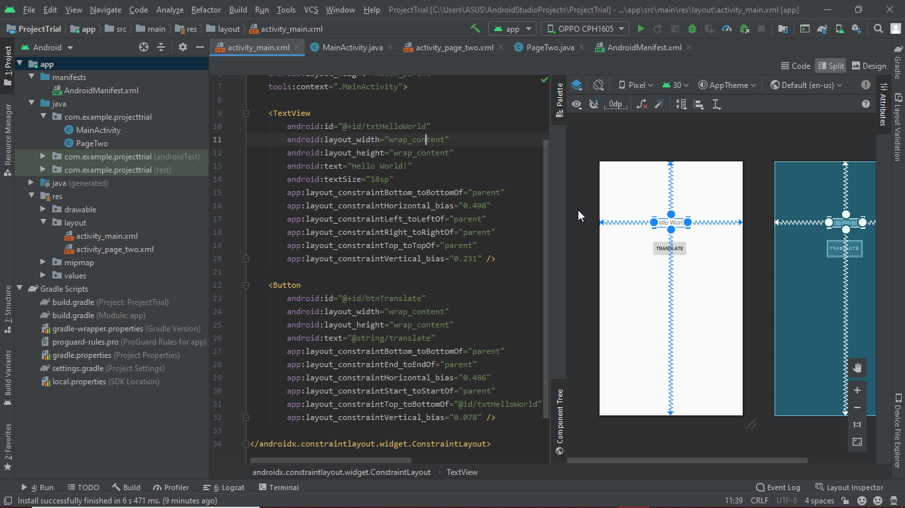
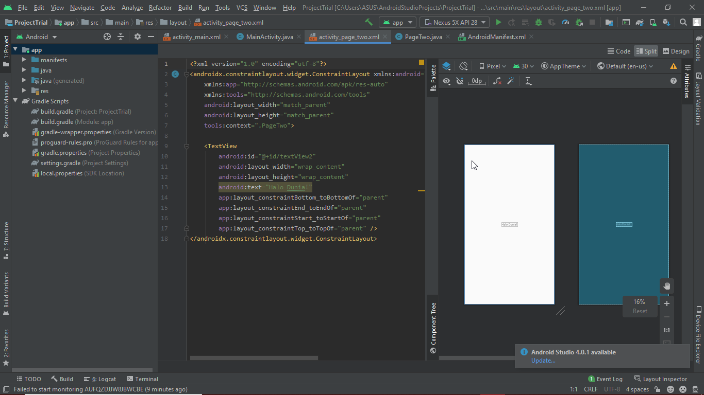
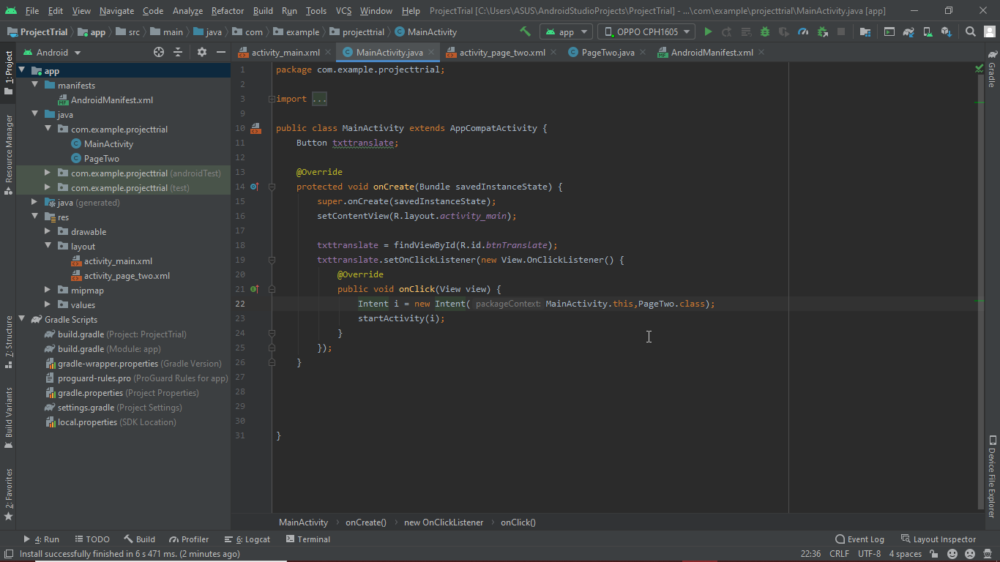
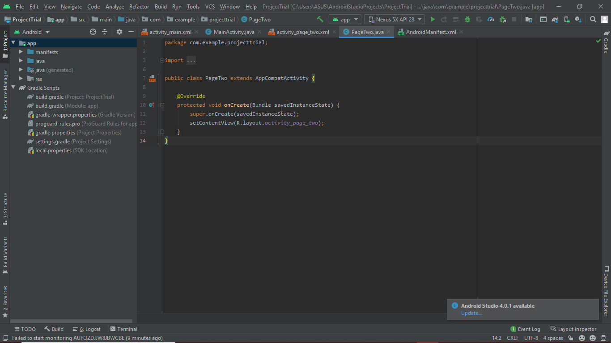

# 01 - Hello World

## Tujuan Pembelajaran

1. Mahasiswa
memahami konsep
layout pada
android.
2. Mahasiswa
memahami konsep
View Group dan
Hierarchy pada
layout.
3. Mahasiswa mampu
membuat layout
sederhana.
4. Mahasiswa
menguasai layout
editor dan
kegunaannya pada
android studio.

## Hasil Praktikum

Layout main :

Layout page_two :

Activity main :

Activity page two :

