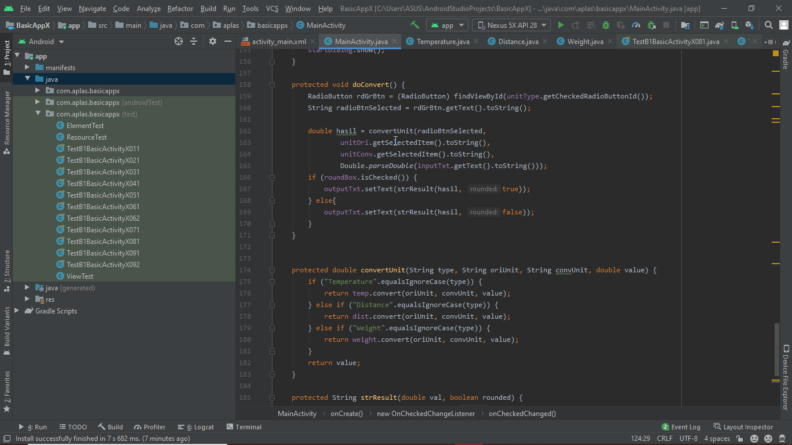
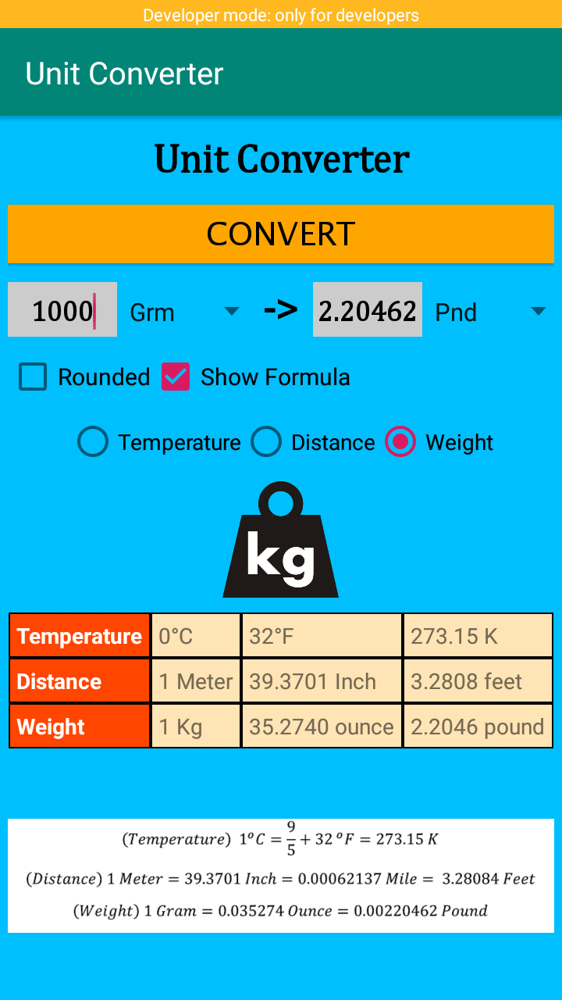

# 03 - Activity

## Tujuan Pembelajaran

1. Pada pembelajaran kali ini, mahasiswa diharapkan mengerti cara kerja dari activity pada android
2. Mahasiswa juga mampu mengimplementasikan dalam bentuk aplikasi jadi sederhana
3. Basic Activity bertujuan untuk mempelajari dasar-dasar pemrograman dalam Activity proyek Android.

## Hasil Praktikum

doConvert() method :

Hasil akhir :

