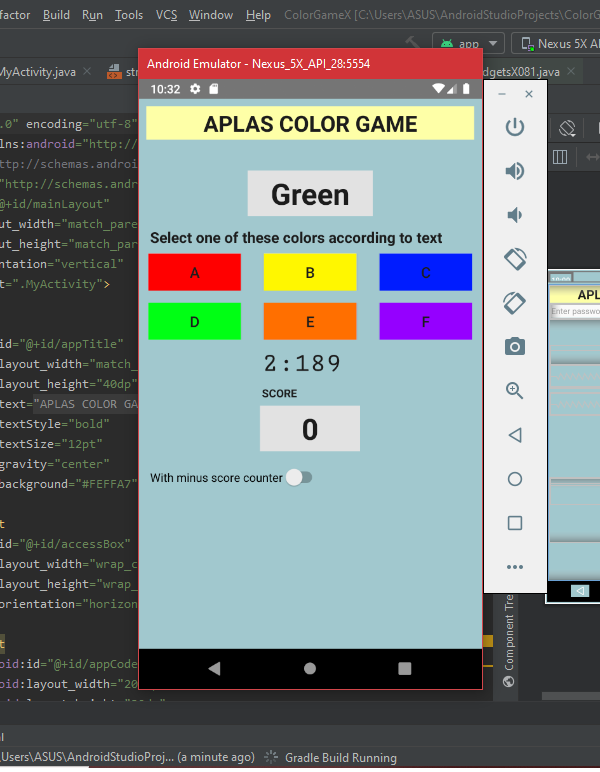

# 04 - Advanced Widget

## Tujuan Pembelajaran

1. Mahasiswa diharapkan bisa mengetahui cara implementasi library widget yang lebih _advanced_ pada Java.
2. Mahasiswa memahami perbedaan dan cara penggunaan Linear Layout dan Relative Layout
3. Mahasiswa mampu membuat game sederhana

## Hasil Praktikum

Hasil akhir :

