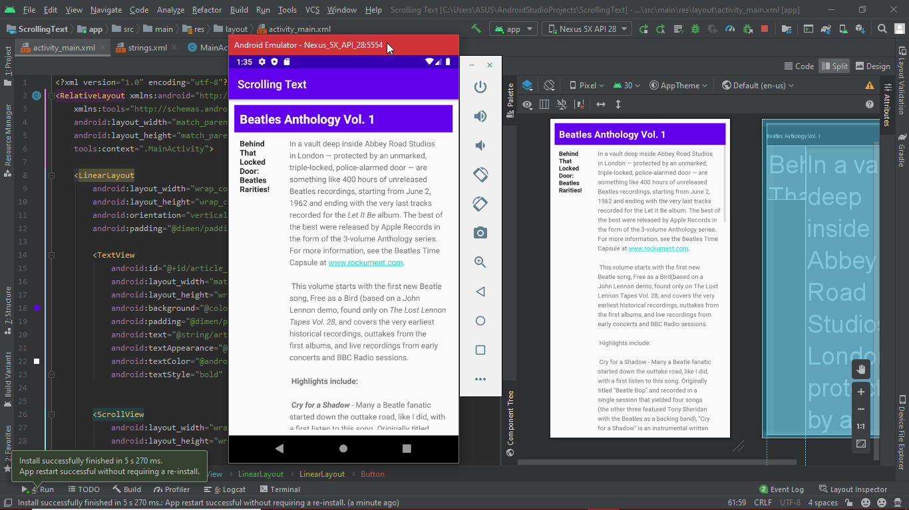

# 04 - Scrollview

## Tujuan Pembelajaran

1. Mahasiswa mampu membuat aplikasi yang menerapkan scrollview
2. Mahasiswa mampu memahami _*formatting styles*_ pada strings.xml

## Hasil Praktikum

Hasil akhir :

