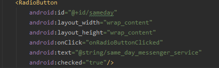
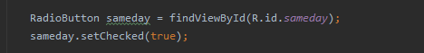
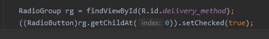
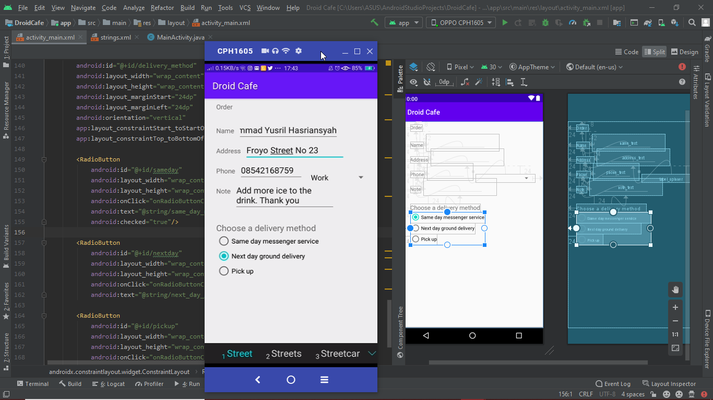
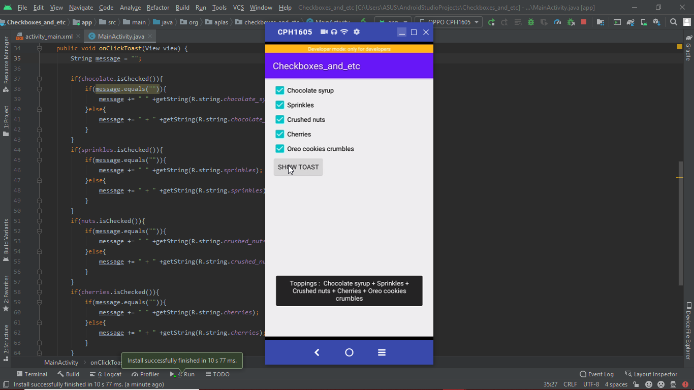
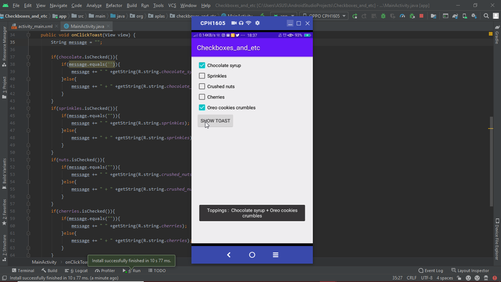
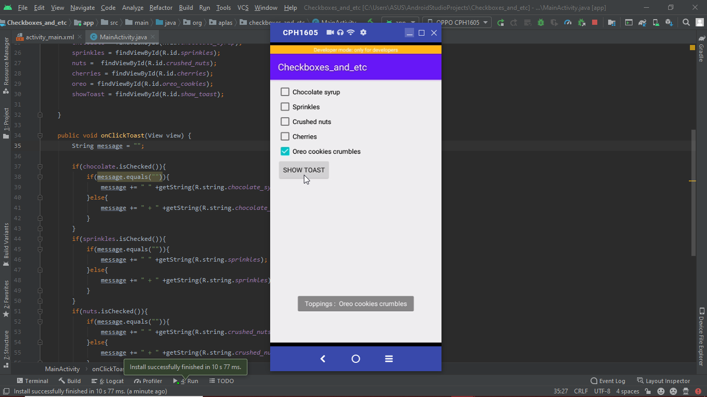

# 06 - Input Control

## Tujuan Pembelajaran

1. Mahasiswa mampu mengimplementasikan tipe input pada setiap edit text sesuai kebutuhan
2. Mahasiswa memahami cara kerja onClick() pada layout yang terhubung dengan method pada activity.java

## Hasil Praktikum

Untuk membuat salah satu radio button terpilih secara otomatis saat aplikasi onCreate() ada beberapa cara :

1. Bisa dilakukan pada layout xml-nya saja.

2. Bisa juga dilakukan pada activity seperti berikut. Di activity pun ada beberapa metode. Berikut beberapa metodenya :
 
    
    atau
    

Ini hasil akhir dari latihannya :

---

Ada _homework_ juga dari codelabs, berikut hasilnya :

1. Dicentang semua

2. Dicentang beberapa

3. Dicentang satu
