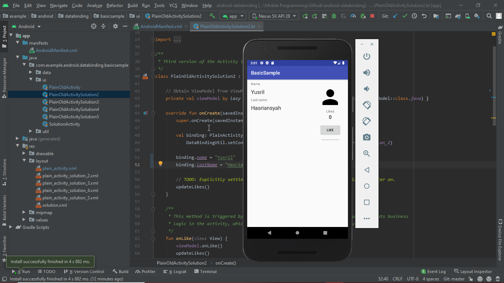
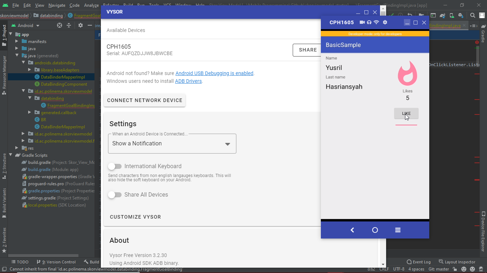
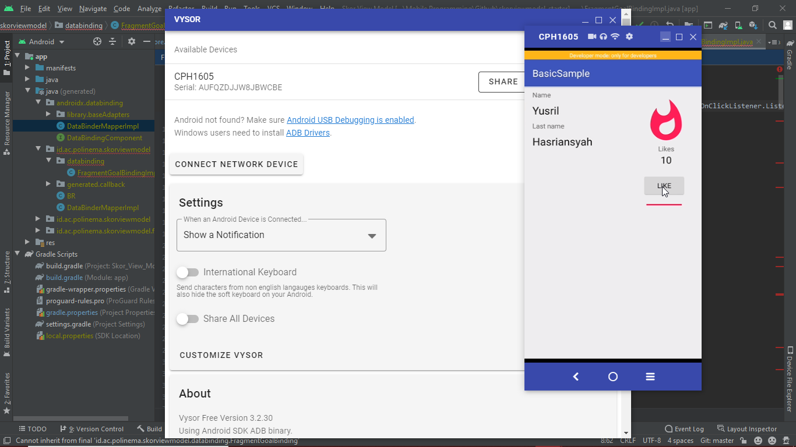

# 07 - Data Binding

## Tujuan Pembelajaran

1. Mahasiswa mampu memahami cara penggunaan data binding/view model
2. Mahasiswa mampu menerapkan penggunaan data binding
3. Mahasiswa mampu menerapkannya di kotlin maupun java

## Hasil Praktikum

Berikut hasil akhir dari aplikasi tersebut :

- Sebelum dilike : 
- like mencapai 5 : 
- like mencapai 10 ke atas : 