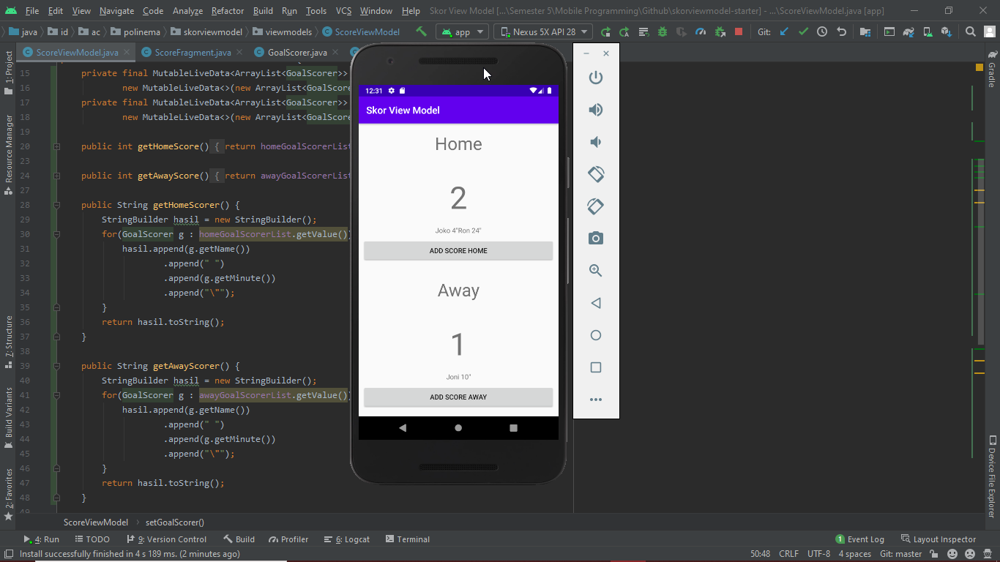
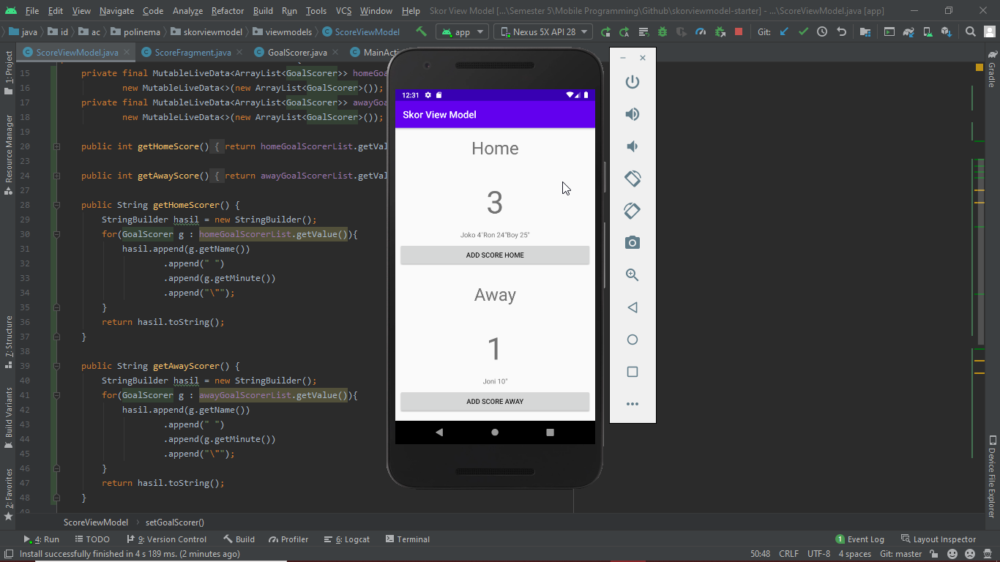

# 08 - View Model

## Tujuan Pembelajaran

1. Mahasiswa mampu memahami cara penggunaan view model
2. Mahasiswa mampu menerapkan penggunaan view model pada studi kasus
3. Mahasiswa mampu menerapkannya di kotlin maupun java

## Hasil Praktikum

Berikut hasil akhir dari aplikasi tersebut :

- Kondisi awal : 
- Setelah ditambahkan score pada home : 
- Setelah ditambahkan score pada away : 